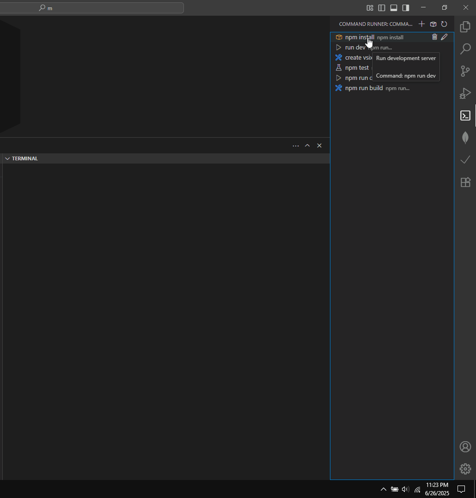

# Command Runner

A VS Code extension to intelligently manage and run custom npm commands.

## How to Use

1. The extension will automatically find and select the most relevant `package.json` file in your workspace. The current file is shown in the status bar.
2.  **Add Commands**:
    *   The extension starts with default commands like `npm install`, `npm run dev`, `npm run build`, and `npm test`.
    *   Click the `+` button in the sidebar to add your own custom commands.
3.  **Run Commands**: Simply click on any command in the sidebar to run it.
4.  **Switch `package.json`**: If you work with multiple `package.json` files (e.g., in a monorepo), click the package icon in the sidebar to easily switch between them. The extension will remember your choice.

The extension handles the complexity of finding the right `package.json` and running commands in the correct directory, so you can focus on your code.